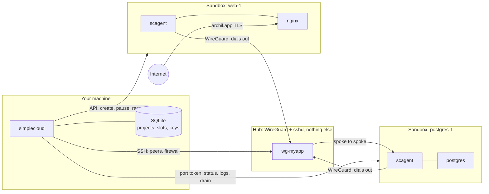
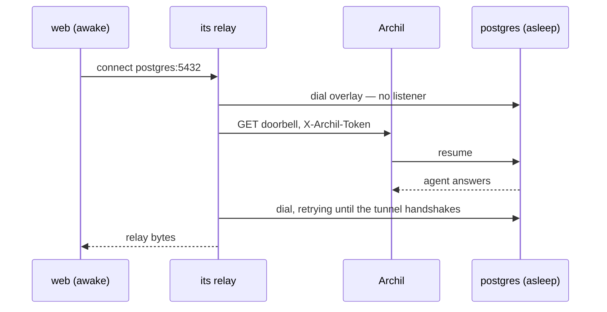
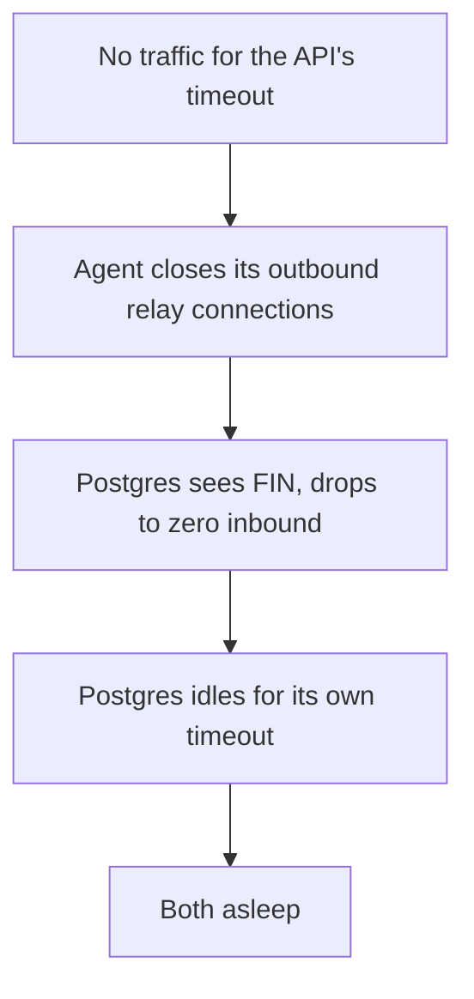

# simplecloud

Deploy a Docker Compose project so each service runs in its own microVM, services reach each other by name over a private network, and idle services sleep and wake on the next request.

The same Compose file runs locally and deployed. Compute and storage come from [Archil](https://archil.com); the private network is WireGuard through a hub you provide.

## Contents

- [What sets it apart](#what-sets-it-apart)
- [Measured](#measured)
- [Quick start](#quick-start)
- [How it works](#how-it-works)
  - [Addressing](#addressing)
  - [Service names and the relay](#service-names-and-the-relay)
  - [Waking](#waking)
  - [Sleeping](#sleeping)
  - [Volumes](#volumes)
  - [Isolation](#isolation)
- [The Compose subset](#the-compose-subset)
  - [Extensions](#extensions)
  - [Local to deployed](#local-to-deployed)
- [Operator guide](#operator-guide)
  - [The hub](#the-hub)
  - [Configuration](#configuration)
  - [Commands](#commands)
  - [Logs](#logs)
  - [Troubleshooting](#troubleshooting)
- [Known limits](#known-limits)
- [Development](#development)

## What sets it apart

- **A sleeping database wakes when something connects to it.** Each service gets an authenticated doorbell, so a service with no public port is still reachable on demand. An unauthenticated request is refused and leaves it asleep. See [Waking](#waking).
- **Sleeping cascades down the stack.** An agent closes its outbound connections before pausing, so the database behind a sleeping API sees a clean FIN, goes idle, and sleeps in turn. See [Sleeping](#sleeping).
- **A slot keeps its identity for life.** Its WireGuard key and overlay address outlive any sandbox, so updating one service replaces its microVM without touching the hub's peer set or the other services. See [Addressing](#addressing).
- **Your image is never modified.** The agent is uploaded and run beside the application, and configures the overlay through netlink rather than tools the image might not ship. `postgres:17-alpine` has neither `wg` nor `ip` and works unchanged. See [How it works](#how-it-works).
- **A local Compose file deploys without edits.** A mapped database port is skipped rather than published to the internet, and `profiles` decides what exists where. See [Local to deployed](#local-to-deployed).
- **No central service.** State is local SQLite, the hub holds no credential, and `reap` from cron is the whole control loop.

## Measured

On one `s-1vcpu-512mb` hub and a two-service project — `nicolaka/netshoot` publishing HTTP, `postgres:17-alpine` private with a volume:

| | |
|---|--:|
| Deploy from `up` to both slots ready | ~30s |
| Create a sandbox | 0.9–3.2s |
| Install the agent (7.2 MB) | 1.3s |
| Public URL, awake | 200 in 0.30s |
| **Reach `postgres:5432` by name** | **0.04s** |
| Overlay round trip through the hub | 13.5ms |
| Doorbell wake of a paused sandbox | 0.77s |
| Public URL wake | 0.80–1.14s |
| **Wake a sleeping database through the relay** | **2.97–4.05s** |
| Unauthenticated doorbell | 401 in 0.29s, stays paused |
| Pause, near-idle service | 0.7–1.8s |
| Pause, database with warm buffers | 20s and up |

`go test -tags integration ./internal/e2e/` reruns all of it in 166s, including teardown.

- **Reaching a service by name costs 0.04s** once awake. The Postgres SSL negotiation is part of the test, so a real server answered rather than a port merely being open.
- **Waking through the relay is the slow path** at 3 to 4s: a resume, a WireGuard re-handshake on both sides, then the application's own accept.
- **Pausing costs what the service holds in memory.** A pause that does not finish falls back to `stopped` and loses memory state, so treat sleeping as an optimisation rather than a guarantee.

## Quick start

You need an Archil API key on a plan that permits egress, and a Linux host for the hub with a public address and inbound UDP `51820–51899`. One core and 512 MiB is enough.

```console
export ARCHIL_API_KEY=key-...
export SIMPLECLOUD_HUB=root@203.0.113.10

./scripts/build.sh                       # cross-compiles the agent, embeds it, builds the CLI
./bin/simplecloud hub add --bootstrap     # installs wireguard-tools and nftables, pins the host key
./bin/simplecloud doctor                  # credential, hub, forwarding, firewall, handshakes
```

A project needs nothing but images:

```yaml
services:
  web:
    image: nginx
    ports: ["8080:80"]
  postgres:
    image: postgres:17
    environment:
      POSTGRES_PASSWORD: devpassword
    volumes: [pgdata:/var/lib/postgresql/data]
volumes:
  pgdata: {}
```

```console
simplecloud up                            # ~30s to both ready
simplecloud endpoints                     # public URLs and in-project addresses
open $(simplecloud url web)
simplecloud exec web -- curl postgres:5432 # reachable by name, over the private network
```

Then let it sleep, from cron:

```console
*/1 * * * *  simplecloud reap --all
```

## How it works

The CLI owns every decision. The hub forwards encrypted packets and accepts SSH. The agent configures its own sandbox and relays connections to peers.



### Addressing

Each project gets a `/24` from `10.88.0.0/16`. The hub is `.1`; slots run from `.10`. A **slot** owns its WireGuard keypair and overlay address for life, both held in SQLite, and sandboxes are disposable incarnations of it.

That is what makes a per-service update cheap. Replacing a sandbox reuses the slot's key, so the hub's peer set is byte-identical afterward and no other service notices.

Every sandbox is `192.168.249.2/30` on its own point-to-point link, identical across sandboxes, so the platform supplies no usable addressing. All of the above is allocated by the CLI.

### Service names and the relay

The agent writes `/etc/hosts` pointing each peer service at a **loopback alias**, not at the peer's overlay address:

```
127.0.1.10	postgres postgres-1
```

A connection to `postgres:5432` therefore reaches a local relay that knows exactly which service and port was wanted. The relay forwards to the peer's overlay address without inspecting bytes, so any TCP protocol works.

That indirection is what makes wake-on-connect possible with nothing in the hub's data path. No sandbox has an inbound UDP endpoint, so every overlay packet passes through the hub.

### Waking

Every sandbox serves an HTTP listener on port `48080`, reachable only through an Archil **port token**. The port is never published.



An authenticated request wakes a paused sandbox in 0.77s. An unauthenticated one returns 401 in 0.29s and **leaves it paused**, so learning a hostname buys nothing — not even the cost of a wake. Both the dial and the doorbell retry for three minutes, because the caller may itself have just woken and its first outbound request can fail.

The same listener serves the control API the CLI uses for status, activity, logs, and drain, gated on a second token. A wake cannot read logs.

### Sleeping

Archil's own idle timeout counts attached process connections rather than traffic, so it would pause a busy service. It is pinned to `0` and the agent accounts for activity instead.

**Activity is an established inbound connection on a declared port.** A public service sees those from the internet, a private one over the overlay; one rule covers both. Outbound connections are deliberately not activity for the service that opens them, or an API holding an idle pool would look busy forever.

A service with no reachable port cannot be observed at all, so it defaults to keep-awake.



The drain is the part that matters. Pausing snapshots memory and stops the VM; it does not close sockets. Without draining first, a peer would keep seeing `ESTABLISHED` until TCP keepalive expired — two hours by default — and a database behind a sleeping API would never go idle.

A stack's time to sleep is therefore the **sum** of the timeouts along the chain, not the longest.

### Volumes

Each named volume is one Archil disk, mounted by the agent before the application starts. A mount failure is fatal: starting a database with an empty data directory looks like success and fails much later.

Archil enforces a single writer, and `simplecloud volumes` shows who holds the delegation. Revocation has a window worth knowing about — a revoked client keeps accepting writes that report success and are never durable, until another client acquires the delegation — so a handover must stop the old owner first.

### Isolation

Two enforcement points, and the hub's is the one that matters on a shared hub.

Forwarding plus a route per project would bridge them: a packet from one project addressed to another passes WireGuard's source check, because only its own source is validated, and is then routed straight out the other interface. So the hub drops forwarded traffic by default and accepts only same-interface flows:

```
chain forward {
  type filter hook forward priority 0; policy drop;
  iifname "wg-myapp"   oifname "wg-myapp"   accept
  iifname "wg-scratch" oifname "wg-scratch" accept
}
```

One rule per project, rebuilt from the full project list on every `up`. A wildcard on both sides would permit exactly what this prevents. The policy also denies overlay-to-internet forwarding, and the input chain admits only the agents' heartbeat ICMP, so the hub's own SSH is unreachable from inside a project.

In the sandbox, the agent restricts `wg0` to the project's range and declared ports. Many application images have no `nft`, so that layer degrades to the hub's with a logged warning.

## The Compose subset

Supported: `image`, `build`, `command`, `environment`, `env_file`, `ports`, `volumes` (named), `healthcheck`, `depends_on`, `profiles`, `deploy.replicas`, `deploy.resources.reservations`. Everything else is rejected with a message naming what to do instead, never ignored.

A service needs only `image:` or `build:`. Most defaults come from the image itself:

| Value | Taken from |
|---|---|
| `command` | The image's entrypoint and cmd |
| Environment | The image's env, overlaid by Compose |
| Working directory, user | The image's config |
| Reachable ports | The image's exposed ports, plus any `ports:` |

Reading the image config is what makes `command` optional. A sandbox never runs the image's entrypoint — PID 1 is Archil's init and nothing else starts — so without it every service would need an explicit command.

### Extensions

| Key | Default | Meaning |
|---|---|---|
| `x-simplecloud-idle-timeout` | `15m` | Idle duration before sleeping. `0` never sleeps |
| `x-simplecloud-keep-awake` | true with no reachable port | Never sleep |
| `x-simplecloud-vcpu` | `deploy.resources`, else 1 | 1–32 |
| `x-simplecloud-memory` | `deploy.resources`, else 1024 | MiB, 256–65536 |
| `x-simplecloud-region` | operator config | Compute region |
| `x-simplecloud-max-ttl` | `86400` | Hard TTL, capped at 24h |
| `x-simplecloud-doorbell-port` | `48080` | Agent listener port |
| `x-simplecloud-log-ring` | `4MiB` | In-sandbox log window |
| `x-simplecloud-environment` | none | Variables applied only when deployed |
| `x-simplecloud-env-file` | none | Env file read only when deployed |
| `x-simplecloud-egress` | unrestricted | Outbound allowlist |
| `x-simplecloud-sync` | none | Local paths copied into a disk each deploy |
| `x-simplecloud-publish` | none | Publish a port that is skipped by default |
| `x-simplecloud-name` | directory name | Project label, top level |

### Local to deployed

**Bind mounts are the only thing that forces a change.**

A mapped datastore port is **skipped, not rejected**. A Compose file written for local development routinely maps a database port for a GUI client, and locally that keeps working. Deploying it verbatim would put the database on the internet unauthenticated, so the entry is dropped and the deploy continues:

```
postgres  not publishing 5432 — datastore port, and published ports are unauthenticated
          reachable in this project as postgres:5432
          to publish anyway: x-simplecloud-publish: [5432]
```

`profiles` decides what exists where. `profiles: [cloud]` is active here and inactive under `docker compose up`, so a backup service deploys without running locally. `profiles: [local]` is the reverse.

Deploy-only configuration replaces a local endpoint without a second file:

```yaml
services:
  minio:
    image: minio/minio
    profiles: [local]            # not deployed
  api:
    image: myapi
    environment:
      S3_ENDPOINT: http://minio:9000
    x-simplecloud-environment:
      S3_ENDPOINT: https://s3.us-east-1.amazonaws.com
    x-simplecloud-env-file: .env.cloud
```

**Bind mounts need a decision**, because only you know whether a path holds configuration, data, or source. `x-simplecloud-sync` copies local into a disk on every deploy — one-way and clobbering, so never point it at a path a service writes to. A **named volume** is for data the service owns. There is no live link to your laptop either way.

## Operator guide

### The hub

You provide the host; `--bootstrap` prepares it. A stock Ubuntu image with nothing installed is enough, so cloud-init is an optimisation rather than a prerequisite.

```console
simplecloud hub add root@203.0.113.10 --identity ~/.ssh/id_ed25519 --bootstrap
simplecloud hub status
```

`hub add` pins the SSH host key and refuses a later change. It installs `wireguard-tools` and `nftables`, enables and persists IPv4 forwarding, writes the firewall, and sets `/etc/wireguard` to mode 700. It is re-runnable.

| | |
|---|---|
| Size | One core, 512 MiB. Choose for **bandwidth**, not CPU — every byte between services passes through it |
| Image | Any current Ubuntu; `--bootstrap` uses `apt` |
| Network | Public IPv4, inbound UDP `51820–51899` |
| Access | SSH as root, or a passwordless-sudo user |

Three things stay yours: providing the host, opening the UDP range if a firewall sits in front of it, and DNS. The hub's private keys are generated on the hub and never leave it.

### Configuration

Environment alone is enough; no file is required.

| Variable | Meaning |
|---|---|
| `ARCHIL_API_KEY` | Compute credential |
| `SIMPLECLOUD_HUB` | Hub SSH target |
| `SIMPLECLOUD_HUB_IDENTITY` | SSH identity. Defaults to the agent, then the usual key names |
| `SIMPLECLOUD_HUB_ENDPOINT` | WireGuard endpoint, when the data path differs from the SSH path |
| `SIMPLECLOUD_REGION` | Compute region, default `aws-us-east-1` |
| `SIMPLECLOUD_REGISTRY` | Registry for built images |
| `SIMPLECLOUD_PROFILES` | Extra Compose profiles |
| `SIMPLECLOUD_HOME` | Overrides `~/.simplecloud` |

Precedence is flag, then environment, then `~/.simplecloud/config.toml`. `hub add` writes what you pass into that file, so later runs need no environment.

A project's identity is bound to the directory holding its Compose file, so two checkouts sharing a name stay distinct and renaming a directory does not orphan a project. `simplecloud link <project>` rebinds a moved one. Nothing is ever written inside your project tree.

### Commands

| | |
|---|---|
| `up [service…]` | Converge. Named services update only those |
| `sleep` / `wake [service…]` | Pause and resume explicitly |
| `reap` | Pause everything past its idle timeout. The cron target |
| `down` | Destroy the project. `--volumes` also deletes disks |
| `ls` `ps` `show` | Projects, slots, and one slot in detail |
| `endpoints` `url` | Public URLs and in-project addresses |
| `logs` `exec` | Output and a shell |
| `volumes` | Disks, slots, delegation holders |
| `build` `registry add` | Build and push without deploying |
| `hub add` / `status` / `set-endpoint` | Register and inspect the hub |
| `link` `plan` `reconcile` `doctor` | Rebind, dry run, repair drift, preflight |

`down` destroys and `sleep` pauses. They are separate verbs because sleeping is the central behavior and conflating them would be a trap.

`up` is also the repair path: a slot whose agent is not answering gets it reinstalled, so a cold boot does not need a different command.

### Logs

The sandbox keeps a 4 MiB window. Bytes written there land in page cache, and pausing snapshots RAM, so a larger cache would slow every sleep. History accumulates on your machine, capped at 512 MiB and pruned oldest first.

`reap` is what makes a window that small safe: it already contacts every running slot for its activity, so the log pull rides the same round trip and your cron cadence becomes your capture cadence.

```console
simplecloud logs                 # last 200 lines, every slot, interleaved
simplecloud logs web -f          # backlog first, then stream
simplecloud logs postgres        # a sleeping slot reads stored output rather than waking
simplecloud logs web --source agent   # where wake, tunnel, and mount problems surface
```

Output is JSONL on disk — timestamp, stream, text — because shipping anywhere needs exactly what raw bytes discard. If a service outruns its window between pulls, the gap is recorded rather than hidden.

### Troubleshooting

Each of these presents as something other than its cause. `doctor` checks the ones it can detect ahead of time.

| Symptom | Cause |
|---|---|
| Everything times out, no error | Egress denied by plan tier. A sandbox cannot reach the hub |
| A sandbox comes up with egress still denied | `create_sandbox(network=…)` is accepted and silently ignored; only a later update works |
| A slot never becomes ready | Inbound UDP to the hub is blocked, so the tunnel never handshakes. `hub status` reports it per peer |
| A service is unreachable while the overlay looks healthy | The application is not listening — check `logs` for its exit code |
| A volume looks mounted and holds no data | The mount failed and writes went to the sandbox root. The agent treats this as fatal |
| Writes acknowledged then missing | Written after a delegation was revoked and before the new owner mounted |
| An image runs but behaves wrongly | It is not `linux/amd64` |

## Known limits

- **All traffic passes through the hub.** No sandbox has an inbound UDP endpoint, so there is no spoke-to-spoke path. The hub is a single point of failure and the bandwidth ceiling.
- **Everything pauses within 24 hours.** The platform caps a sandbox's lifetime, so "running" is never durable. Wake-on-demand covers it.
- **Sleeping is not a state guarantee.** A pause that does not complete falls back to `stopped`, losing memory. Design for a cold boot.
- **Published ports are public and unauthenticated**, any TCP over TLS with SNI. No custom domains.
- **State is per-machine.** Overlay ranges and listen ports come from the local database, so two machines deploying to one hub would collide. One operator per hub.
- **Volume handover is unimplemented.** A replacement recreates without revoking, so moving a volume between slots is unproven.
- **amd64 only**, and the agent is a second process in every sandbox, counting against the slot's memory.
- **No per-connection replica balancing, no rolling updates, no UDP between services.** A base service name resolves to slot 1.
- **A scheduled job has no reachable port**, so it defaults to keep-awake and bills continuously. A cron beside `reap` is cheaper: `simplecloud exec postgres -- pg_dump …`.

## Development

```console
./scripts/build.sh      # agent for linux/amd64, embedded, then the CLI
go test ./...           # unit tests, no network
```

Integration tests need a live account and a hub:

```console
export ARCHIL_API_KEY=... SC_TEST_HUB=root@... SC_TEST_HUB_IDENTITY=~/.ssh/id_ed25519
go test -tags integration ./internal/archil/   # client, doorbell semantics
go test -tags integration ./internal/hub/      # bootstrap, pinning, isolation
go test -tags integration ./internal/e2e/      # the full lifecycle, 166s
```

Every resource carries a test prefix and is deleted in `t.Cleanup`, including after a failure, and a leak is reported as a test failure rather than left to a bill.

There is no Go SDK for Archil. `internal/archil` implements the REST surface and the process WebSocket framing, both derived from the published Python SDK and verified against the live API — including five places where the documented shape and the real one disagree:

| | |
|---|---|
| Egress policy | `PUT`, not `POST` |
| Create disk | camelCase `diskId`, with the mount token nested in `authorizedUsers` — unlike list and get, which use `id` |
| Resolve image | The field is `source`; the API's error for a missing one names `base_image` |
| Resolve image | Asynchronous, so it must be polled until `ready` before a sandbox can use it |
| Create sandbox | A `network` field is accepted and silently ignored |
